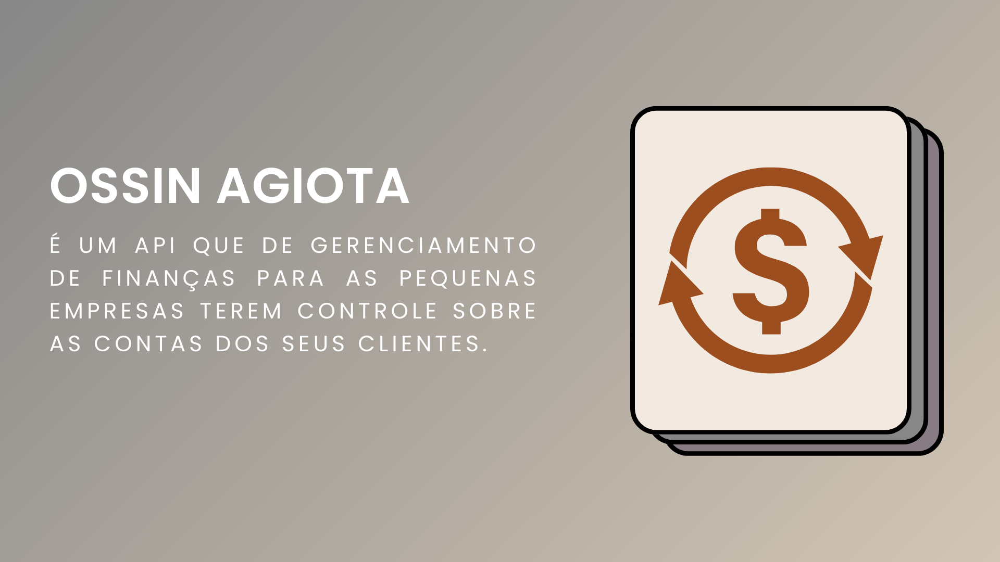

# OssinAgiota

[](https://www.canva.com/design/DAGOhcQdjQE/rijrVWD9CZ9jScgFwdygdw/edit?utm_content=DAGOhcQdjQE&utm_campaign=designshare&utm_medium=link2&utm_source=sharebutton)

#### Segue abaixo os requisitos para ultilização da api:

- php 8.2 ou superior
- composer

#### Segue abaixo instruções para ultilização da api:

- instalaçào de dependencias

  ```console
    composer init
  ```

- Gerando chave do laravel

  ```console
  php artisan key:generate
  ```

- Criação do banco de dados
  ```console
  php artisan migrate
  ```

> Agora é so aproveitar a api!

```console
    php artisan serve
```
